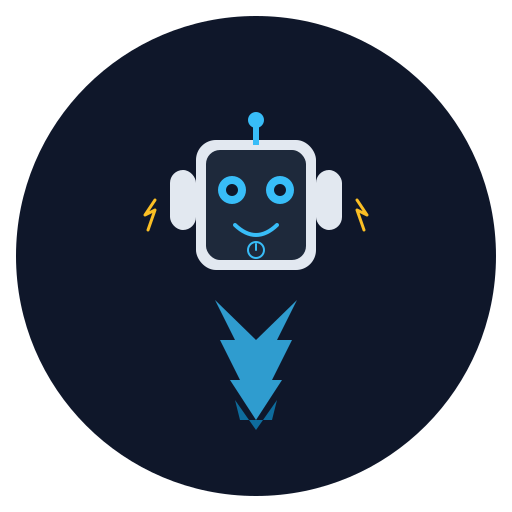

<p align="center">
  
</p>

<h1 align="center">BotBoot</h1>

<p align="center">
  <strong>Boot AI agents anywhere. One API.</strong>
</p>

<p align="center">
  <a href="#quick-start-self-hosted">Quick Start</a> ·
  <a href="#api-reference">API Docs</a> ·
  <a href="#supported-runtimes">Runtimes</a> ·
  <a href="#supported-providers">Providers</a>
</p>

<p align="center">
  <strong>Supported Runtimes</strong>
</p>

<p align="center">
  <a href="https://openclaw.ai"></a>
  <a href="https://hermes-agent.nousresearch.com"></a>
</p>

<p align="center">
  <strong>Supported Infrastructure</strong>
</p>

<p align="center">
  <a href="https://hetzner.cloud"></a>
  <a href="https://www.docker.com"></a>
  <a href="https://phala.network"></a>
</p>

---

BotBoot is an open-source platform for deploying and managing isolated AI agent instances. Each agent gets its own VM with full isolation — persistent memory, messaging channels, and workspace files. Framework-agnostic: supports [OpenClaw](https://openclaw.ai), [Hermes Agent](https://hermes-agent.nousresearch.com), and more.

```bash
curl -X POST https://api.botboot.dev/v1/agents \
  -H "Authorization: Bearer bb_your-api-key" \
  -d '{
    "runtime": "openclaw",
    "name": "my-agent",
    "files": {
      "SOUL.md": "You are a helpful research assistant...",
      "USER.md": "# Owner\nName: Alice"
    }
  }'
```

## The Problem

You're building a product that gives each user their own AI agent. Maybe it's a marketing concierge, a support bot, a research assistant. You've built one agent and it works. Now you need to launch **hundreds or thousands** of them.

You quickly discover:

- **There's no API to spin up isolated agents at scale.** You're writing custom infra code for every deployment.
- **Agent frameworks** (LangChain, CrewAI) help you *build* agents but don't *host* them — you're on your own for provisioning, secrets, lifecycle management.
- **Cloud platforms** (Railway, Modal, Fly.io) host *apps* but don't understand agents — no concept of identity files, persistent memory, messaging channels, or per-agent LLM key management.
- **Cloud AI services** (AWS Bedrock, Vertex AI) are enterprise-only, framework-locked, and don't give per-user isolation.
- **You can't track LLM usage per agent**, rotate API keys across a fleet, or update agent identities without SSHing into every box.

There's a gap in the stack:

```
                    Agent-Aware
                        ↑
                        │
    CrewAI / LangGraph  │     ??? (THE GAP)
    (build agents,      │     (deploy + manage 100s of
     no hosting)        │      isolated agents via API)
                        │
   ─────────────────────┼────────────────────────→ Per-User
                        │                          Isolation
    Railway / Modal     │     DIY on bare metal
    (host apps,         │     (build everything
     not agent-aware)   │      yourself)
                        │
                        ↓
```

**BotBoot fills that gap.** One API to deploy, manage, and scale isolated AI agents — each with their own VM, identity, secrets, and messaging channels. Framework-agnostic. Self-hostable. Open source.

## Why BotBoot?

| Problem | BotBoot Solution |
|---------|-----------------|
| No API to deploy agents at scale | `POST /v1/agents` — one call, one agent |
| Can't manage secrets across a fleet | 3-tier key management (platform → account → agent) |
| Agent frameworks don't host agents | We handle infra — you define the agent |
| Locked to one framework | OpenClaw, Hermes, bring your own |
| No per-agent usage tracking | Per-agent runtime info, secrets, and file access |
| Vendor lock-in | Self-host with `docker compose up` |

## Features

- **🔌 Framework-agnostic** — OpenClaw, Hermes Agent, or bring your own
- **🏗️ Infra-agnostic** — Hetzner, Docker (local), TEE (planned)
- **🔒 Full VM isolation** — Each agent is a separate machine
- **📁 File API** — Read/write agent workspace files (SOUL.md, skills, etc.)
- **🔑 3-tier secrets** — Platform → Account → Agent level key management
- **💬 Built-in channels** — Telegram, WhatsApp, Discord out of the box
- **📊 Lifecycle management** — Create, start, stop, delete, backup, update
- **🔓 Open source** — Self-host on your own Hetzner account

## Quick Start (Self-Hosted)

```bash
git clone https://github.com/mcclowin/botboot
cd botboot
cp .env.example .env
# Edit .env: add HETZNER_API_TOKEN + at least one LLM key

docker compose up
# → API running at http://localhost:3001
```

### Generate an API key

```bash
curl -X POST http://localhost:3001/v1/auth/api-keys \
  -H "Content-Type: application/json" \
  -d '{"email":"you@example.com","name":"tevy2-platform"}'
# → {"key": "bb_abc123...", "prefix":"bb_abc123", "name": "tevy2-platform", "account_id":"..."}
```

### Set account-level secrets

```bash
curl -X PUT http://localhost:3001/v1/secrets \
  -H "Authorization: Bearer bb_abc123..." \
  -H "Content-Type: application/json" \
  -d '{
    "OPENAI_AUTH_JSON": "...",
    "TAVILY_API_KEY": "..."
  }'
# → {"success":true,"keys":["OPENAI_AUTH_JSON","TAVILY_API_KEY"]}
```

### Deploy your first agent

```bash
curl -X POST http://localhost:3001/v1/agents \
  -H "Authorization: Bearer bb_abc123..." \
  -d '{
    "runtime": "openclaw",
    "name": "research-bot",
    "files": {
      "SOUL.md": "You are a research assistant. Be thorough and cite sources."
    }
  }'
# → {"id": "uuid", "state": "provisioning", "ip": "..."}
```

### Check boot progress

```bash
curl http://localhost:3001/v1/agents/{id}/boot-status \
  -H "Authorization: Bearer bb_abc123..."
# → {"stage": "ready", "progress": 100, "ready": true}
```

## API Reference

### Agents

| Method | Endpoint | Description |
|--------|----------|-------------|
| `POST` | `/v1/agents` | Create agent |
| `GET` | `/v1/agents` | List agents |
| `GET` | `/v1/agents/:id` | Get agent details + status |
| `DELETE` | `/v1/agents/:id` | Delete agent (backup first) |
| `POST` | `/v1/agents/:id/start` | Power on |
| `POST` | `/v1/agents/:id/stop` | Shutdown |
| `POST` | `/v1/agents/:id/update` | Update agent runtime |
| `POST` | `/v1/agents/:id/backup` | Create backup |
| `GET` | `/v1/agents/:id/runtime` | Runtime info (version, gateway status) |
| `GET` | `/v1/agents/:id/boot-status` | Poll provisioning progress |

### Files

| Method | Endpoint | Description |
|--------|----------|-------------|
| `GET` | `/v1/agents/:id/files/*` | Read workspace file |
| `PUT` | `/v1/agents/:id/files/*` | Write workspace file |

### Secrets

| Method | Endpoint | Description |
|--------|----------|-------------|
| `PUT` | `/v1/secrets` | Set account-level secrets |
| `GET` | `/v1/secrets` | List secret names (no values) |
| `DELETE` | `/v1/secrets/:key` | Remove a secret |
| `PUT` | `/v1/agents/:id/secrets` | Set agent-level secret overrides |
| `GET` | `/v1/agents/:id/secrets` | List agent secrets (names + inheritance) |

### Auth

| Method | Endpoint | Description |
|--------|----------|-------------|
| `POST` | `/v1/auth/api-keys` | Generate API key |
| `GET` | `/v1/auth/api-keys` | List API keys |
| `DELETE` | `/v1/auth/api-keys/:id` | Revoke API key |

## Architecture

```
┌─────────────────────────────────┐
│         BotBoot API             │
│         (Hono + TypeScript)     │
├────────────┬────────────────────┤
│ Providers  │ Runtimes           │
│ (where)    │ (what)             │
│            │                    │
│ ● Hetzner  │ ● OpenClaw         │
│ ● Docker   │ ● Hermes Agent     │
│ ● TEE*     │ ● (add your own)   │
└─────┬──────┴────────┬──────────┘
      │               │
      ▼               ▼
  Provisions VM    Installs runtime
  Manages lifecycle  Injects identity
                    Writes configs
```

### Secret Resolution

```
Agent ANTHROPIC_API_KEY =
  agent.secrets.ANTHROPIC_API_KEY       ← Agent override
  ?? account.secrets.ANTHROPIC_API_KEY  ← Account default
  ?? platform.ANTHROPIC_API_KEY         ← Platform fallback
  ?? error("No key configured")
```

## Supported Runtimes

| Runtime | Status | Install Method |
|---------|--------|---------------|
| [OpenClaw](https://openclaw.ai) | ✅ Supported | `npm install -g openclaw` |
| [Hermes Agent](https://hermes-agent.nousresearch.com) | 🚧 Coming soon | `uv pip install -e ".[all]"` |

### Adding a Runtime

Runtimes are pluggable. Implement the `Runtime` interface:

```typescript
interface Runtime {
  name: string;
  install(ssh: SSHClient): Promise<void>;
  writeConfig(ssh: SSHClient, config: AgentConfig): Promise<void>;
  writeIdentity(ssh: SSHClient, files: Record<string, string>): Promise<void>;
  startGateway(ssh: SSHClient): Promise<void>;
  stopGateway(ssh: SSHClient): Promise<void>;
  gatewayStatus(ssh: SSHClient): Promise<"active" | "inactive" | "failed">;
  getVersion(ssh: SSHClient): Promise<string>;
}
```

See `src/runtimes/openclaw.ts` for a reference implementation.

## Supported Providers

| Provider | Status | Cost | Isolation |
|----------|--------|------|-----------|
| Hetzner Cloud | ✅ Supported | ~€4.49/agent/mo | Full VM |
| Docker (local) | 🚧 Planned | Free | Container |
| Phala TEE | 🚧 Planned | Variable | Hardware TEE |

## Self-Hosting

BotBoot is designed to be self-hosted. You need:

1. A **Hetzner Cloud** account ([sign up](https://hetzner.cloud))
2. A **PostgreSQL** database (or use the included docker-compose)
3. At least one **LLM API key** (Anthropic, OpenRouter, etc.)

That's it. No vendor lock-in, no managed service required.

## Contributing

PRs welcome. See [CONTRIBUTING.md](CONTRIBUTING.md) for guidelines.

## License

[MIT](LICENSE)

---

Built by [Brain&Bot](https://brainandbot.gg) 🧠🤖
